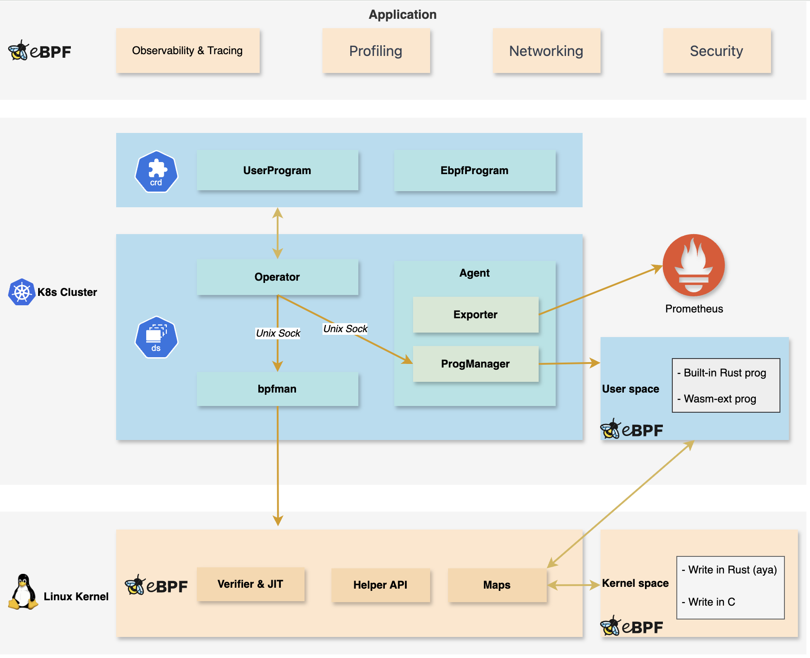
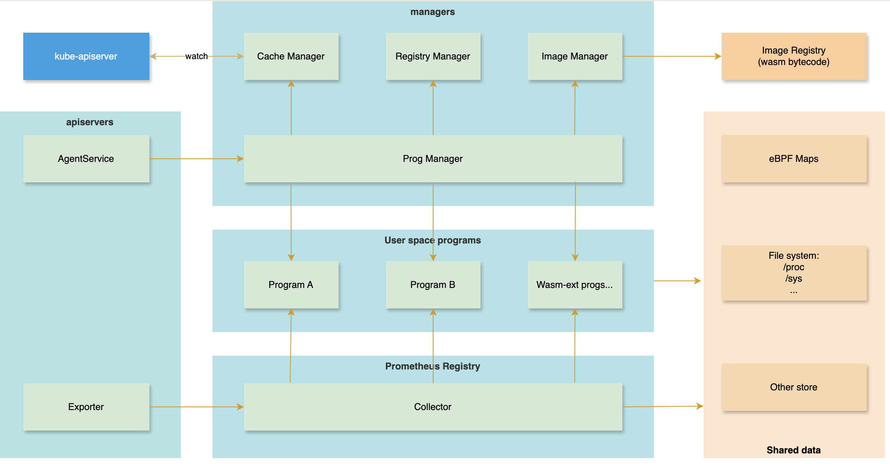

# eva

## Introduction

eBPF is a powerful technology that enables low-overhead and dynamic instrumentation of the Linux kernel and user space
applications.
However, deploying and managing eBPF programs in a Kubernetes cluster presents certain challenges.

The bpfman project provides a good way to simplify the deployment and management of kernel space eBPF programs.

However, there is a lack of management for user space eBPF programs. Each user space eBPF Program is deployed as a
daemonset, which increases the number of pods, leading to an increase in resource overhead and management costs.

The goal of the eva is to simplify the deployment and management of eBPF programs, including both kernel space
and user space.
For kernel space, we will integrate with bpfman for management.
For user space, we will deploy a single daemonset in the cluster to manage all eBPF programs, and we will provide an
extensible mechanism based on wasm for user space eBPF programs.

## Features

- **Management**: Provide CRDs for eBPF programs, including both kernel space and user space.
- **Security**: Improved security based on bpfman. Because only the bpfman daemon, which can be tightly controlled, has
  the
  privileges needed to load eBPF programs, while access to the API can be controlled via standard RBAC methods.
- **Extensibility**: Support for user space eBPF programs based on wasm, which can be easily extended to support other
  languages.
- **Simplified Deployment**: Only a single daemonset is needed to manage all eBPF programs.
- **Metrics Export**: Provide an exporter, which can uniformly export industry-standard Prometheus metrics.

## Design

### Architecture

The eva consists of the following components:

- **Operator**: The Operator is responsible for managing the lifecycle of eBPF programs, encompassing both kernel and
  user spaces. For kernel space, the Operator interacts with bpfman, while for user space, it communicates with the
  agent. Both interactions occur via Unix domain socket communication.
- **Agent**: The Agent is responsible for managing user space eBPF programs. It includes an RPC server to provide
  management interfaces, and an HTTP server to provide metrics. The Agent can run multiple user programs simultaneously
  and supports extensibility.

#### Agent Architecture

The Agent consists of the following components:

- **RPC Server**: The RPC server provides management interfaces for user programs. It listens on a Unix domain socket
  and supports the following operations:
    - Load: Load a user program.
    - Unload: Unload a user program.
    - List: List all user programs.
    - Get: Get the status of a user program.
    - Update: Update a user program.
- **HTTP Server**: The HTTP server provides metrics for user space eBPF programs. It interacts with the Exporter to
  obtain metrics. The Exporter calls the collector method of each user program (each user program implements the
  Collector Trait to provide metrics), while also providing metrics of the Agent itself.
- **Program**: The Program is a user program (it can also interact without eBPF Maps, such as only obtaining data
  through /sys or /proc). A Program can be a built-in Rust program, or a wasm program introduced through an extension
  mechanism.
- **Managers**:
    - **Program Manager**: The Program Manager is responsible for managing user programs. It interacts with the
      Registry Manager, Cache Manager, and Image Manager to manage user programs. It provides interfaces for loading,
      unloading, listing, getting, and updating user programs. The Program Manager is also responsible for starting and
      stopping user programs.
    - **Cache Manager**: The Cache Manager provides shared information for user programs, such as the metadata of
      kubernetes cluster.
    - **Registry Manager**: The Registry Manager maintains a list of user programs and provides interfaces for managing
      user programs. Both built-in Rust programs and wasm programs are maintained by the Registry Manager.
    - **Image Manager**: The Image Manager is in charge of managing the images of user programs. It offers interfaces
      for pulling images of user programs and provides bytecode for the Program Manager to load.
- **Exporter**: The Exporter is responsible for exporting metrics. It interacts with the HTTP Server to provide metrics
  for user programs. The Exporter calls the collector method of each user program to obtain metrics.

## Discussion

- The project name.
- Perhaps the Exporter could be deployed as a separate container. We could add a manager called 'metrics' that is
  responsible for collecting data from the user program and storing it. The Exporter would then read data from the
  specified storage to provide metrics.
